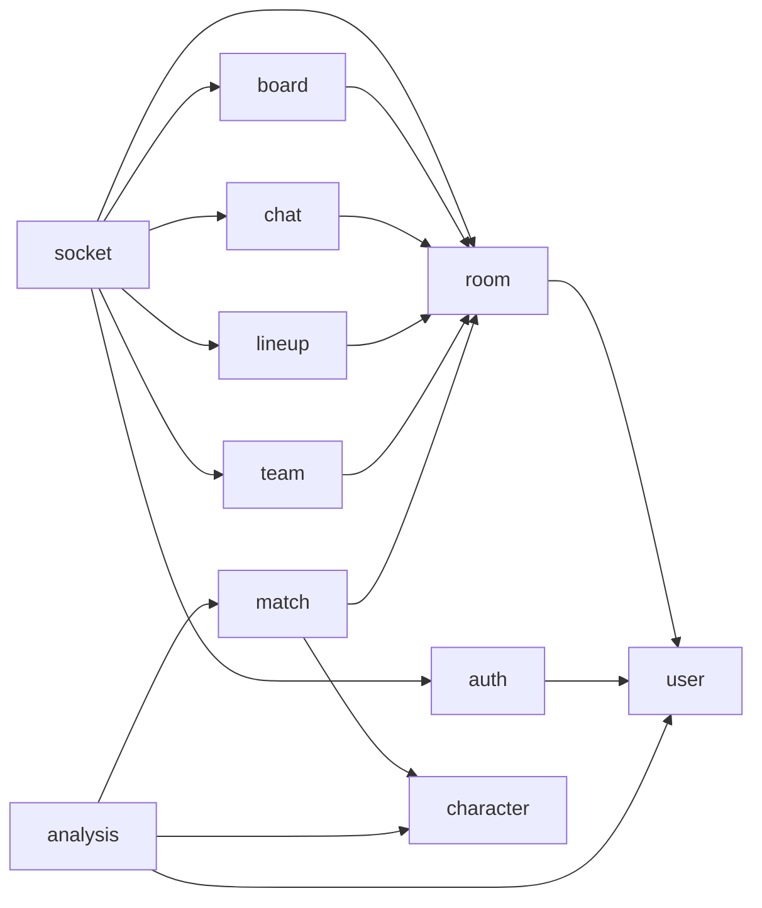
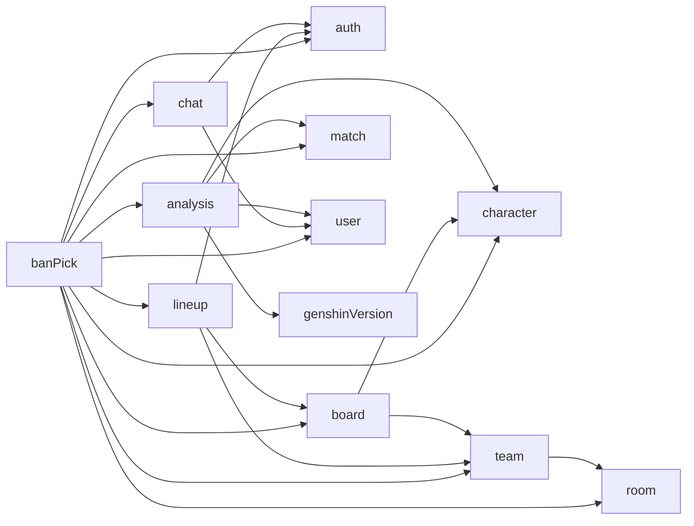

# Genshin Ban Pick

多人即時協作的 Ban/Pick 系統，支援即時同步（Socket.IO）、角色管理、戰術白板。

## 技術堆疊

| 層      | 技術                                      |
| ------- | ----------------------------------------- |
| Frontend | Vue 3 + TypeScript + Pinia + Naive UI + Vite |
| Backend  | Node.js + Express + Socket.IO + Prisma   |
| Database | PostgreSQL                                |

## Repository 結構

```
backend/            # Express + Socket.IO + Prisma
genshin-ban-pick/   # Vue 3 frontend
shared/contracts/   # 共用 TS 型別（兩端都用 @shared/* alias 引入）
```

## 模組依賴

兩邊都是 Clean Architecture，各自分成 ~12 個 feature 模組。下圖只畫 feature 模組之間的依賴邊；省略純工具模組（後端 `errors` / `utils`，前端 `shared`）。箭頭方向 = 依賴方向（`A → B` 代表 A import B）。

### Backend (`backend/src/modules/`)



- **`room`** 是房間內 in-memory 狀態的中央 hub：`board / chat / lineup / team` 都透過 `IRoomStateRepository` 讀寫它，本身只依賴 `user`（identity 解析）。
- **`socket`** 是 realtime 模組的 composition root，把所有 feature service 接到 Socket.IO 事件上。
- **`match`** 是 DB 寫入路徑：吃 `room` 的 snapshot，寫出帶 `character` reference 的 row。
- **`analysis`** 是 DB 讀取/統計路徑：從 `match` + `character` + `user` 算 aggregate。

### Frontend (`genshin-ban-pick/src/modules/`)



- **`banPick`** 是頁面層 orchestrator（`useBanPickFacade` 把所有 feature 串起來），fan-out 最大。
- **`lineup → board`** 不只是型別共用：`useLineupPool` 讀 `boardStore.boardImageMap` + `matchSteps` 來決定哪些 Pick 過的角色可以拖進 lineup 格子。砍掉這條邊就得複製 board state 或把 pool 解析推到 `board` 裡。
- **`auth`** 是底層 identity provider（leaf）。
- **`shared`**（圖中略）是 DI keys / image registry / theme composable / 共用元件的雜物間，每個模組都會 import 它，但反向不會。

### 跨邊（shared contracts）

`shared/contracts/<domain>/` 是兩邊都吃的 TS-only DTO / value-type 倉庫，用 `@shared/*` alias 引入。
新增跨邊型別必須放這，不能在某一邊複製一份。

## 快速開始

### 前置需求

- Node.js v22+
- PostgreSQL

### 安裝

```bash
# 若 npm install 卡住，用 ipv4 優先模式
NODE_OPTIONS=--dns-result-order=ipv4first npm install
```

### 環境變數

`.env` 放在 repo 根目錄（`backend/` 的上層）。

### 開發伺服器

```bash
# Terminal 1 — Backend (port 3000)
cd backend && npm run dev

# Terminal 2 — Frontend (port 5173, proxy /api → 3000)
cd genshin-ban-pick && npm run dev
```

## 常用指令

### Backend (`cd backend`)

```bash
npm run dev      # 開發伺服器
npm run build    # 打包 → dist/
npm start        # 執行 dist/index.js
```

### Frontend (`cd genshin-ban-pick`)

```bash
npm run dev          # Vite dev server
npm run build        # vue-tsc + vite build
npm run type-check   # 型別檢查（不產出 bundle）
npm run lint         # oxlint + eslint --fix
npm run format       # prettier --write src/
```

## 資料庫

### Prisma

```bash
npx prisma generate                     # 產生 Prisma Client
npx prisma migrate dev --name <name>    # 建立新 migration（本地）
npx prisma migrate deploy               # 套用 migration（正式）
```

### Seed 靜態資料

```bash
npx tsx --env-file=../.env prisma/scripts/importGenshinVersions.ts
npx tsx --env-file=../.env prisma/scripts/importCharacters.ts
```

> `--env-file=../.env` 是必要的，tsx 不會自動載入 .env。

### Migration 注意事項

- 有資料回填需求：手動新增 SQL migration 檔案，再執行 `npx prisma migrate dev`
- 有刪除欄位/表格的 migration：分兩次部署（先移除應用層參照，再套用 schema 變更）

## 部署（Docker + EC2）

服務跑在 EC2 的 docker compose stack（postgres + backend）。本機 build image，用 `scripts/deploy-to-ec2.sh` 推到 EC2（t3.micro 撐不起 docker build）。

```bash
# 部署（Mac → EC2）
EC2_HOST=ec2-user@98.86.73.53 ./scripts/deploy-to-ec2.sh
```

流程：`buildx (linux/amd64)` → gzip → scp → EC2 docker load → recreate backend container。不動 postgres container 與 volume。

### EC2 日常操作

```bash
ssh ec2-user@98.86.73.53
cd ~/Genshin-Ban-Pick/Genshin-Ban-Pick

docker compose ps               # container 狀態
docker compose logs -f backend  # 即時 log
docker compose stop             # 暫停（保留資料）
docker compose start            # 從 stop 恢復
docker compose down             # 拆 container（volume 保留）
docker compose up -d            # 重新啟動
```

⚠️ **絕對不要 `docker compose down -v`** — 會砍 volume，DB 資料蒸發。

### 進 container

```bash
docker exec -it genshin-banpick-backend sh
docker exec -it genshin-banpick-db psql -U postgres -d genshin_banpick
```

### Mac 端 alias（選用）

```bash
# ~/.zshrc
alias genshin-stop='ssh ec2-user@98.86.73.53 "cd ~/Genshin-Ban-Pick/Genshin-Ban-Pick && docker compose stop"'
alias genshin-start='ssh ec2-user@98.86.73.53 "cd ~/Genshin-Ban-Pick/Genshin-Ban-Pick && docker compose start"'
alias genshin-deploy='EC2_HOST=ec2-user@98.86.73.53 ~/Desktop/side/Genshin-Ban-Pick/scripts/deploy-to-ec2.sh'
```

### 本地 Hybrid 開發（docker postgres + host backend）

```bash
# Terminal 1 — 只起 postgres (port 5434)
docker compose up -d postgres

# Terminal 2 — backend dev server
cd backend && npm run dev

# Terminal 3 — frontend dev server
cd genshin-ban-pick && npm run dev
```

驗證 prod-like build：
```bash
docker compose up -d --build  # 完整 stack
# 開 http://localhost:3000
```

從 host PG 同步資料到 docker PG：
```bash
./scripts/sync-host-db-to-docker.sh
```

## 複製 Server DB（EC2 → 本機）

### 建立 SSH Tunnel（推薦用 SSH config）

```ssh-config
# ~/.ssh/config
Host genshin-ec2
    HostName 98.86.73.53
    User ec2-user
    IdentityFile ~/Desktop/ec2_keys/aws-discord-bot-farmer-licence-key.pem
    LocalForward 5433 localhost:5432   # EC2 原生 PG
    LocalForward 5435 localhost:5434   # EC2 docker PG (genshin)
```

```bash
ssh genshin-ec2   # 同時建兩條 tunnel
```

手動建 tunnel（不用 SSH config）：
```bash
# EC2 原生 PG
ssh -i "~/Desktop/ec2_keys/aws-discord-bot-farmer-licence-key.pem" -L 5433:localhost:5432 ec2-user@98.86.73.53
ssh -i "C:\Users\asdfg\ec2_keys\aws-discord-bot-farmer-licence-key.pem" -L 5433:localhost:5432 ec2-user@98.86.73.53

# EC2 docker PG
ssh -i "~/Desktop/ec2_keys/aws-discord-bot-farmer-licence-key.pem" -L 5435:localhost:5434 ec2-user@98.86.73.53
ssh -i "C:\Users\asdfg\ec2_keys\aws-discord-bot-farmer-licence-key.pem" -L 5435:localhost:5434 ec2-user@98.86.73.53
```

### 匯出（EC2 → 本機）

```bash
# pg_dump 版本不符時改用 homebrew v15
/opt/homebrew/opt/postgresql@15/bin/pg_dump -h localhost -p 5435 -U postgres -d genshin_banpick -F c -f prod_dump.backup
```

### 匯入（本機）

```bash
# 清空本機 DB
psql -h localhost -p 5432 -U wangxiaoyu -d postgres -c "DROP DATABASE genshin_banpick;"
psql -h localhost -p 5432 -U wangxiaoyu -d postgres -c "CREATE DATABASE genshin_banpick;"

# 還原
pg_restore -h localhost -p 5432 -U wangxiaoyu -d genshin_banpick -F c prod_dump.backup
```

## Port 配置（Mac 端）

| Port | 用途                                        |
| ---- | ------------------------------------------- |
| 5432 | host 原生 PG（其他專案）                    |
| 5433 | SSH tunnel → EC2 原生 PG                    |
| 5434 | local docker postgres                       |
| 5435 | SSH tunnel → EC2 docker PG（genshin stack） |
| 3000 | backend（同時服 frontend 靜態檔）           |
| 5173 | Vite dev server（HMR）                      |
