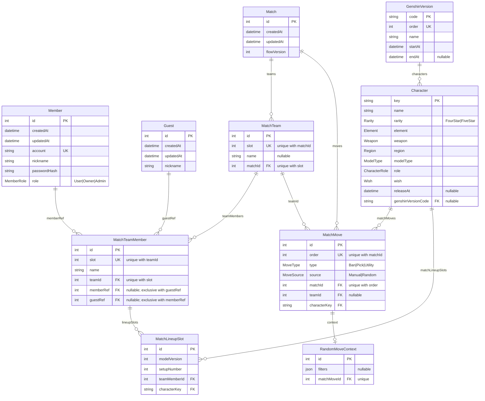

# 資料庫結構圖

> 由 `backend/prisma/schema.prisma` 整理而來。修改 schema 後請同步更新此圖。

## ER 圖

## 結構重點

三個邏輯群組：

1. **使用者** — `Member`（註冊帳號）與 `Guest`（臨時）兩種身份，都透過 `MatchTeamMember` 的可空外鍵 `memberRef` / `guestRef` 接進對局。兩者**至多一個非空**（CHECK `MatchTeamMember_ref_exclusive`）；兩者皆 null 代表只有名字的歷史玩家（name-only）。

2. **對局** — `Match` → `MatchTeam` → `MatchTeamMember` → `MatchLineupSlot` 一條由上往下的 cascade 鏈（刪 `Match` 會連帶刪光）。`MatchMove` 記錄 Ban/Pick 動作，掛在 `Match` 下、可選地關到某個 `MatchTeam`；隨機產生的 move 額外有 1:1 的 `RandomMoveContext` 存 filter。

3. **靜態字典** — `Character` 與 `GenshinVersion`，由 seed script 匯入，被 `MatchMove` / `MatchLineupSlot` 以 `characterKey` 參照（這兩條為純參照，無 `onDelete: Cascade`）。

## 約束（constraints）

- **唯一鍵** — `MatchTeam (matchId, slot)`、`MatchTeamMember (teamId, slot)`、`MatchMove (matchId, order)`。`order` 是整場 match 全域遞增的單一序號，故唯一範圍含 `matchId` 而非 `teamId`；slot 則是「父層內」唯一（team 在 match 內、member 在 team 內）。
- **CHECK** — `MatchTeamMember_ref_exclusive`: `num_nonnulls(memberRef, guestRef) <= 1`（Prisma schema 表達不出，手寫於 migration）。
- **非空** — `Character.role` / `Character.wish` 為 NOT NULL（對齊 `ICharacter` 契約；「無卡池」一律以 `Wish.None` 表示，旅行者亦走 `None`）。
