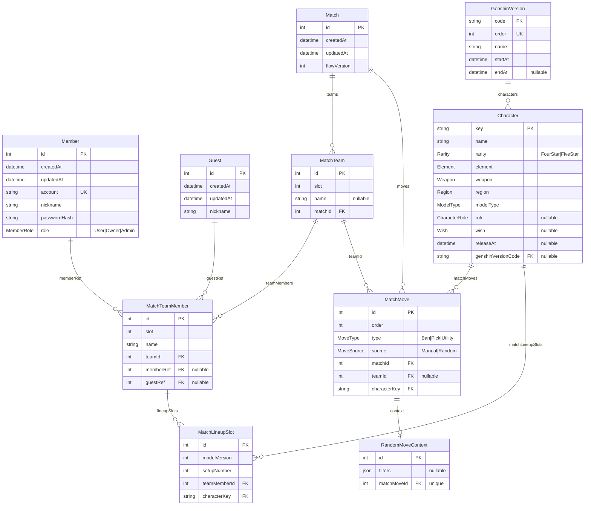

# 資料庫結構圖

> 由 `backend/prisma/schema.prisma` 整理而來。修改 schema 後請同步更新此圖。

## ER 圖

## 結構重點

三個邏輯群組：

1. **使用者** — `Member`（註冊帳號）與 `Guest`（臨時）兩種身份，都透過 `MatchTeamMember` 的可空外鍵 `memberRef` / `guestRef` 接進對局。

2. **對局** — `Match` → `MatchTeam` → `MatchTeamMember` → `MatchLineupSlot` 一條由上往下的 cascade 鏈（刪 `Match` 會連帶刪光）。`MatchMove` 記錄 Ban/Pick 動作，掛在 `Match` 下、可選地關到某個 `MatchTeam`；隨機產生的 move 額外有 1:1 的 `RandomMoveContext` 存 filter。

3. **靜態字典** — `Character` 與 `GenshinVersion`，由 seed script 匯入，被 `MatchMove` / `MatchLineupSlot` 以 `characterKey` 參照（這兩條為純參照，無 `onDelete: Cascade`）。
